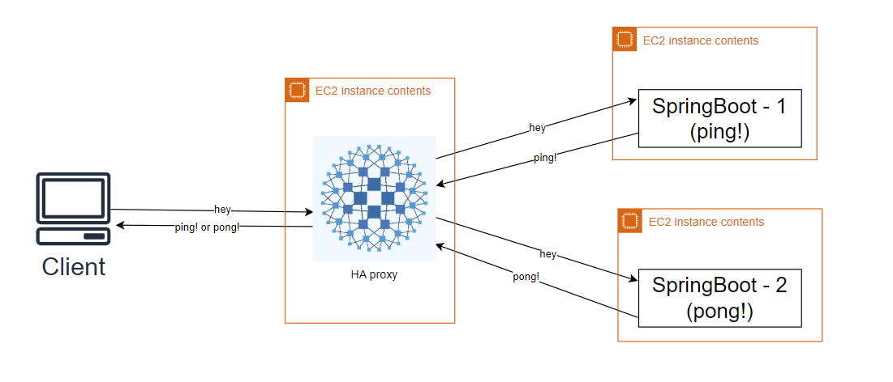
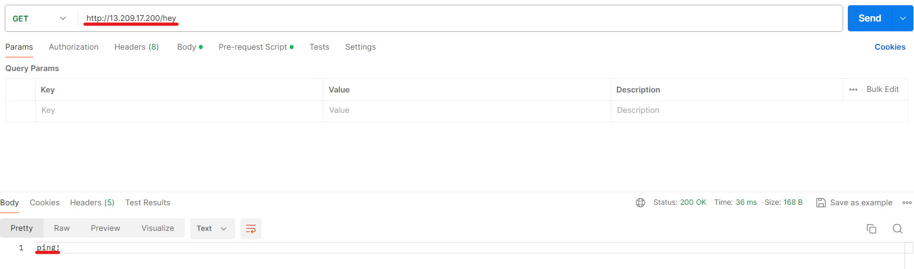
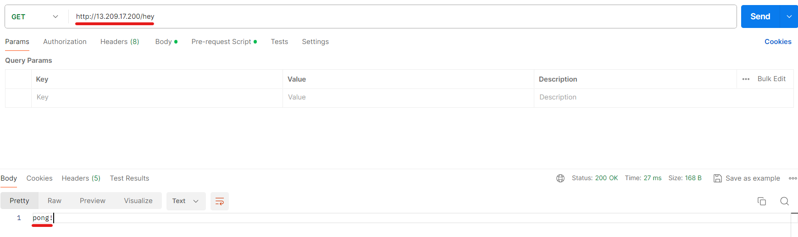

# Haproxy 를 이용한 로드밸런싱 구현


- AWS의 Ubuntu 환경에서 Haproxy를 활용하여 로드밸런싱을 구현하는 프로젝트에 대한 상세 설명입니다.
- 이 프로젝트의 목적은 서버 간에 트래픽을 효과적으로 분산하여 웹 애플리케이션의 가용성과 성능을 최적화하는 것입니다. 
- 로드밸런서로 사용되는 Haproxy는 고가용성, 부하 분산, 그리고 프록시 기능을 제공하며 특히 대규모 서비스에서 널리 사용됩니다. 
- 이 구현을 통해 여러 서버에 걸쳐 사용자 요청을 균등하게 분배하여 각 서버에 가해지는 부하를 줄이고, 전체 시스템의 안정성을 향상시키며, 장애 발생 시 자동 복구의 유연성을 제공합니다. 
- 다음은 AWS Ubuntu 환경에서 Haproxy를 설치하고 구성하여 실제 로드밸런싱을 구현하는 단계별 절차입니다.

## 구현
### 1. apt install 명령어로 haproxy 설치 후 버전 확인
```bash
apt update
apt install haproxy -y
```
```bash
ubuntu@ip-172-31-45-195:~$ haproxy -v

HAProxy version 2.4.24-0ubuntu0.22.04.1 2023/10/31 - https://haproxy.org/
Status: long-term supported branch - will stop receiving fixes around Q2 2026.
Known bugs: http://www.haproxy.org/bugs/bugs-2.4.24.html
Running on: Linux 6.5.0-1014-aws #14~22.04.1-Ubuntu SMP Thu Feb 15 15:27:06 UTC 2024 x86_64
```

### 2. haproxy config 설정
```bash
frontend ping_front
    mode tcp
    bind *:80
    default_backend ping

backend ping 
    mode tcp
    balance roundrobin
    server pingv1 13.125.194.227:8080/hey check
    server pongv1 13.209.69.208:8080/hey check
```
- AWS 환경에서 로드밸런서를 위한 Haproxy 서버 한 대와 로드밸런싱 대상이 될 두 대의 서버를 구성하였습니다. 
- Haproxy 설정에서 로드밸런싱 대상 서버 두 개를 연결하여 트래픽을 분산합니다.

### 3. 로드밸런싱의 대상이 되는 서버 코드
```java
//EC2_1
@RestController
public class controller {
    @GetMapping("/hey")
    public String getMethod() {
        return "ping!";
    }
}

//EC2-1
@RestController
public class controller {
    @GetMapping("/hey")
    public String getMethod() {
        return "pong!";
    }
}
```
- 각 서버는 "ping"과 "pong"이라는 서로 다른 반환값을 가지고 있어 로드밸런싱의 효과를 확인할 수 있습니다.

### 실습결과


- Postman을 통해 확인한 결과, 요청 URL 'http://13.209.17.200:80/hey'에서 서버에 따라 "ping" 또는 "pong"으로 다른 응답을 주는 것을 확인할 수 있습니다.


## Public IP 와 Virtual IP 의 차이
1. **퍼블릭 IP(Public IP)**: AWS EC2 인스턴스를 생성할 때, 해당 인스턴스에 부여되는 공개적으로 접근 가능한 IP 주소입니다. 이 IP 주소를 사용하여 외부에서 해당 EC2 인스턴스에 접속할 수 있습니다. 퍼블릭 IP는 해당 EC2 인스턴스가 직접 사용하는 실제 IP 주소입니다.
2. **가상 IP(Virtual IP)**: 가상 IP는 여러 시스템이 물리적으로 동일한 네트워크 인터페이스를 공유할 때 사용되는 개념입니다. 예를 들어, 로드 밸런서(Load Balancer)나 클러스터링(Clustering) 환경에서 사용될 수 있습니다. 이 경우, 클라이언트가 가상 IP에 접근하면 실제로는 이 IP가 할당된 여러 대의 서버 중 하나에 연결됩니다. 이러한 가상 IP는 물리적인 네트워크 인터페이스와 연관되어 있지만 실제로는 추상화된 개념입니다.

## Virtual IP를 사용하는 이유

1. **트래픽 분산:** VIP(Virtual IP)를 사용하면 로드 밸런서 등의 중간 장치를 통해 클라이언트 요청을 여러 서버로 분산시킬 수 있습니다. 이를 통해 서비스의 성능을 향상시키고, 단일 서버에 가해지는 부하를 분산할 수 있습니다.
2. **서비스의 유연성:** VIP를 사용하면 서버를 추가하거나 제거하더라도 클라이언트 측에서 변경할 필요가 없습니다. 클라이언트는 여전히 VIP를 통해 서비스에 접속할 수 있으며, 서버 구성의 변화에 자동으로 대응할 수 있습니다.